# Moving industrial IoT data to the cloud

> This repository is a working in progress tutorial.


## Architecture

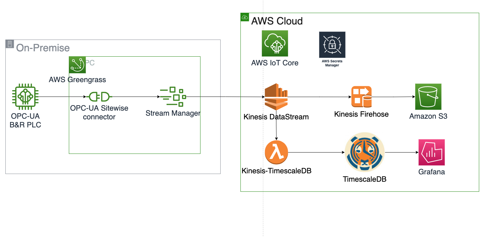


## Components

### 1- Industrial IoT Data (OPCUA)

**OPC Unified Architecture** (**OPC UA**) is a cross-platform, open-source, IEC62541 standard for data exchange from sensors to cloud applications developed by the [OPC Foundation](https://en.wikipedia.org/wiki/OPC_Foundation).

In this tutorial we use **[node-opcua](https://github.com/node-opcua/node-opcua)**, an implementation of an OPC UA stack fully written in Typescript for NodeJS.

#### 1.1- OPCUA-server

##### installing node-opcua as a node package

```bash
$ mkdir mytest
$ cd mytest
$ npm init 
$ npm install node-opcua --unsafe-perms
```

##### installing node-opcua samples as a node package

```bash
$ mkdir myopcuaserver
$ cd myopcuaserver
$ npm init
$ npm install node-opcua-samples --unsafe-perms
$ node ./node_modules/.bin/simple_server
$ node sitewise_workshop_server
```


#### 1.2 - OPCUA-client

```bash
$ node ./node_modules/.bin/simple_client -e "opc.tcp://127.0.0.1:26543" -n="ns=1;s=FanSpeed"
```

Using the node-opcua client through the command above you should be able to see the tag *FanSpeed* from the OPCUA-server.

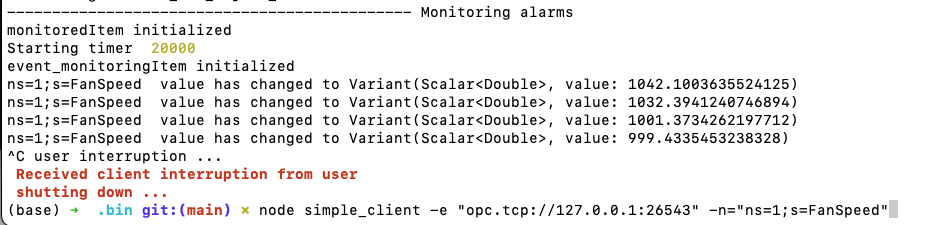


### 2- AWS IoT Greengrass V2


#### 2.1 - Create IoT Edge Device

Greengrass can be installed in linux and windows platforms such as EC2 instance and raspberry-pi, linux machine.

In this tutorial, we are going to run IoT Greengrass in a docker contains following the instructions [here](https://docs.aws.amazon.com/greengrass/v2/developerguide/build-greengrass-dockerfile.html).

##### **2.1.1 - create docker image**

```bash
# Download AWS IoT Greengrass dockerfile package from github https://github.com/aws-greengrass/aws-greengrass-docker/releases
$ wget https://github.com/aws-greengrass/aws-greengrass-docker/archive/refs/tags/v2.5.3.tar.gz 

$ tar -xvzf aws-greengrass-docker-2.5.3.tar.gz
$ cd aws-greengrass-docker-2.5.3
$ docker-compose -f docker-compose.yml build

```

2.5.3 is the *nucleus-version* of greengrass.


##### **2.1.2 -  run AWS IoT Greengrass in docker with automatic provisioning.**

Create .env in the aws-greengrass-docker-2.5.3:

```bash
GGC_ROOT_PATH=/greengrass/v2
AWS_REGION=eu-west-1
PROVISION=true
THING_NAME=MyGreengrassCore
THING_GROUP_NAME=MyGreengrassCoreGroup
TES_ROLE_NAME=GreengrassV2TokenExchangeRole
TES_ROLE_ALIAS_NAME=GreengrassCoreTokenExchangeRoleAlias
COMPONENT_DEFAULT_USER=ggc_user:ggc_group
DEPLOY_DEV_TOOLS=true
```


Update your docker-compose.yml file with the following data.

```yml
version: '3.7'
 
services:
  greengrass:
    init: true
    container_name: aws-iot-greengrass
    image: amazon/aws-iot-greengrass:latest
    volumes:
      - /Users/castrma/.aws/credentials:/root/.aws/:ro 
    env_file: .env
    ports:
      - "8883:8883"
```

/Users/castrma/.aws/credentials is the location of the AWS credentials files. You should change accordingly.


You could also create the image yourself from a Dockerfile like:

```yaml
version: '3.7'
 
services:
  greengrass:
    init: true
    container_name: aws-iot-greengrass
    #image: amazon/aws-iot-greengrass:2.5.3-0
    build:
      context: .
      dockerfile: Dockerfile
    volumes:
      - ./greengrass-v2-credentials:/root/.aws/:ro
    env_file: .env
    ports:
      - "8883:8883"
```


In order to run the docker container, you should run the command:

```bash
$ docker-compose -f docker-compose.yml up -d --build
```


Check your container id using *docker ps*, and access the container running:

```bash
$ docker exec -it dd034cd4aaa1 /bin/bash
```


You can also copy the AWS Greengrass log files using the command:

```bash
$ docker cp dab39303b540:/greengrass/v2/logs /tmp/logs
```


Tips to troubleshoot AWS IoT Greengrass in a Docker container can be found [here](https://docs.aws.amazon.com/greengrass/v2/developerguide/docker-troubleshooting.html).

You should now be able to see your greengrass core device with name "MyGreengrassCore" under AWS IoT -> Greengrass-> Core devices, like:

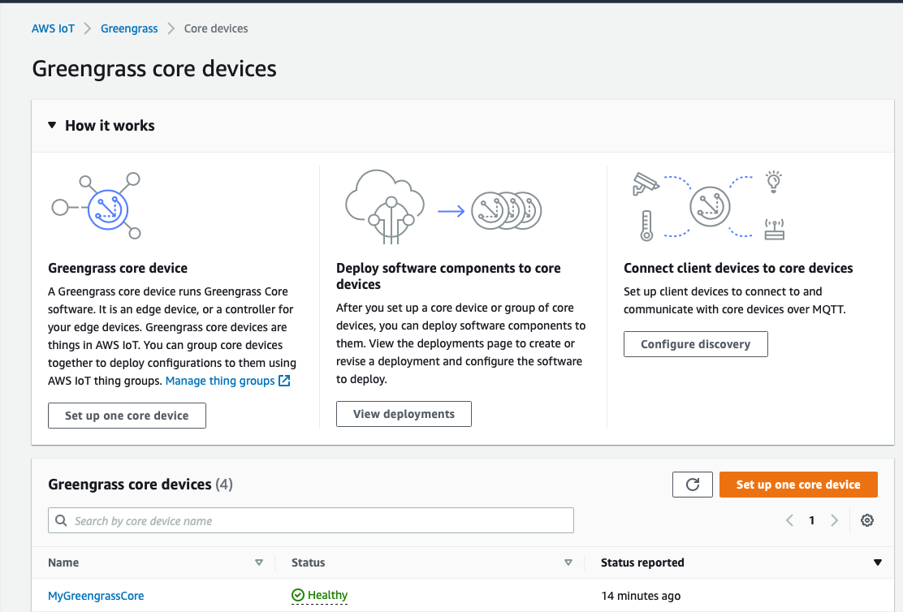


###### 1.2.1 Installing dependencies

The custom made component that ties Stream Manager with Kinesis is written in python and needs the Stream Manager SDK, which can be installed inside the container with the command:

```bash
$ pip3 install stream_manager
```


#### 2.2 - Attach greengrass public components to your deployment


In order to receive opcua messages and overlay them to the cloud, the following components are necessary to be deployed in your greengrass deployment:

- [aws.greengrass.StreamManager](https://eu-west-1.console.aws.amazon.com/iot/home?region=eu-west-1#/greengrass/v2/components/all/aws.greengrass.StreamManager/versions/2.0.14)

- [aws.greengrass.Nucleus](https://eu-west-1.console.aws.amazon.com/iot/home?region=eu-west-1#/greengrass/v2/components/all/aws.greengrass.Nucleus/versions/2.5.4)

- [aws.iot.SiteWiseEdgeCollectorOpcua](https://eu-west-1.console.aws.amazon.com/iot/home?region=eu-west-1#/greengrass/v2/components/all/aws.iot.SiteWiseEdgeCollectorOpcua/versions/2.0.3)

- [aws.iot.SiteWiseEdgePublisher](https://eu-west-1.console.aws.amazon.com/iot/home?region=eu-west-1#/greengrass/v2/components/public/aws.iot.SiteWiseEdgePublisher/versions/2.1.4)

  

The steps below shows how to deploy the **aws.greengrass.StreamManager** public component.

- From the Component details page, select the **Deploy** button

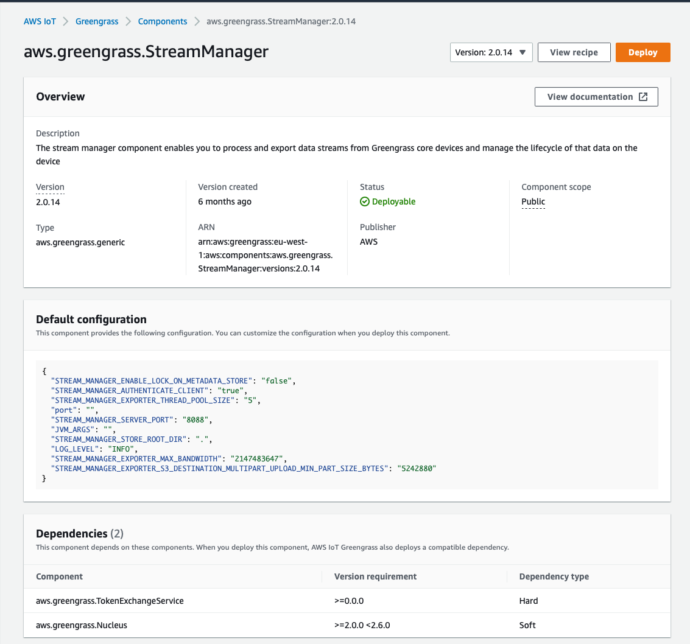


- Select **Add to existing deployment** Select the ‘Deployment for MyGreengrassCoreGroup’ deployment radio button. Select **Next**

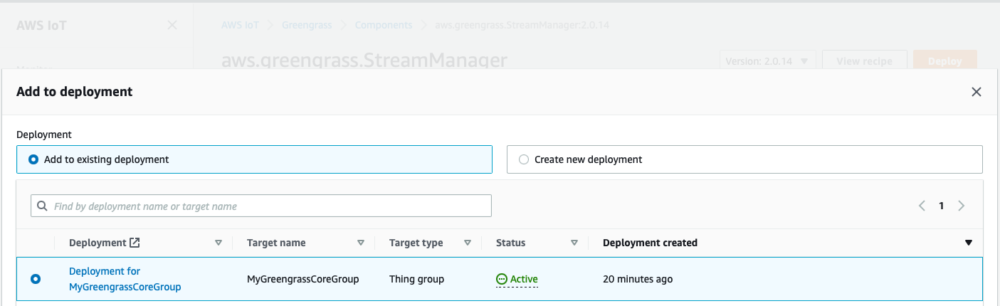


- Verify that both `aws.greengrass.StreamManager`, and `aws.greengrass.Cli` are selected.

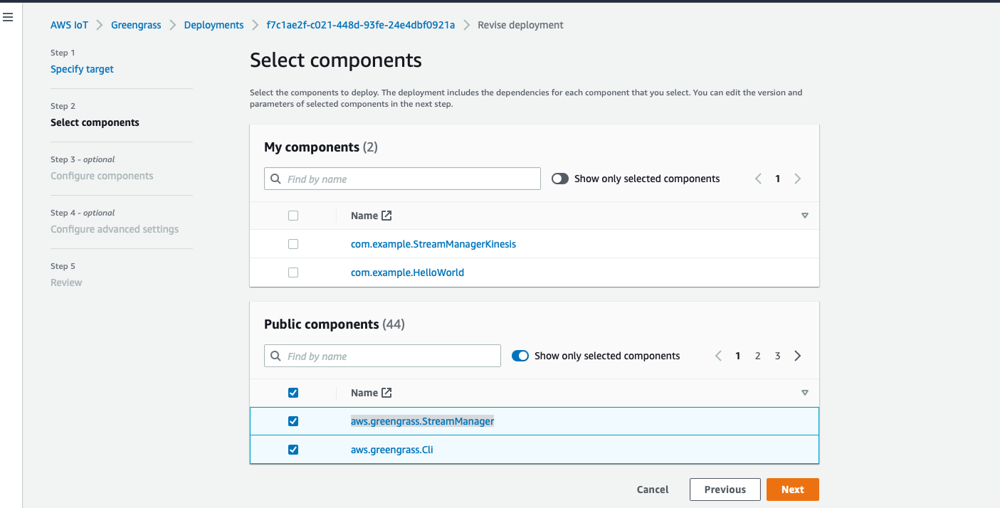

- Select **Deploy** if everything looks OK.

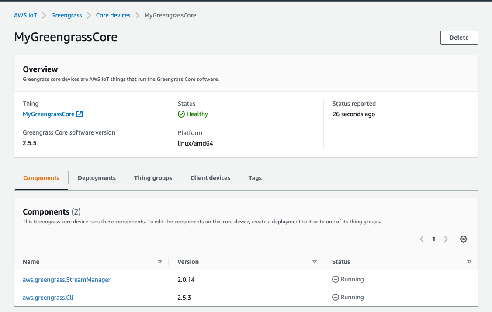


You should use the steps above to install the other public components needed which are:

- **aws.greengrass.Nucleus** 
-  **aws.iot.SiteWiseEdgeCollectorOpcua** 
-  **aws.iot.SiteWiseEdgePublisher**


#### 2.3 AWS SiteWise Gateway

An [AWS IoT SiteWise gateway](https://docs.aws.amazon.com/iot-sitewise/latest/userguide/gateways-ggv2.htmll) connects to data sources to retrieve your industrial data streams, which in our case is the opcua data. The gateway runs on [AWS IoT Greengrass V2](https://docs.aws.amazon.com/greengrass/v2/developerguide/what-is-iot-greengrass.html) as Greengrass components.

##### 2.3.1 - Create a gateway

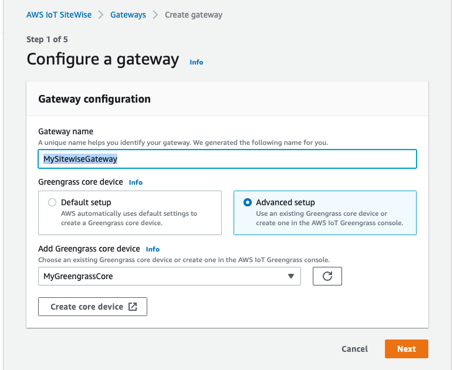

No need to have data processing package as we are not doing any transformation to the data on the edge for now.

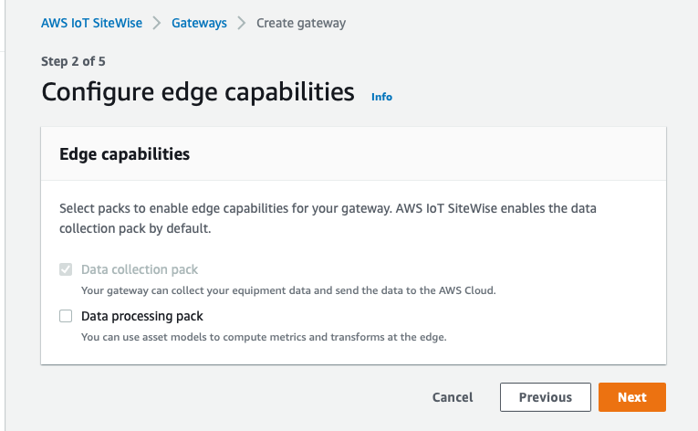


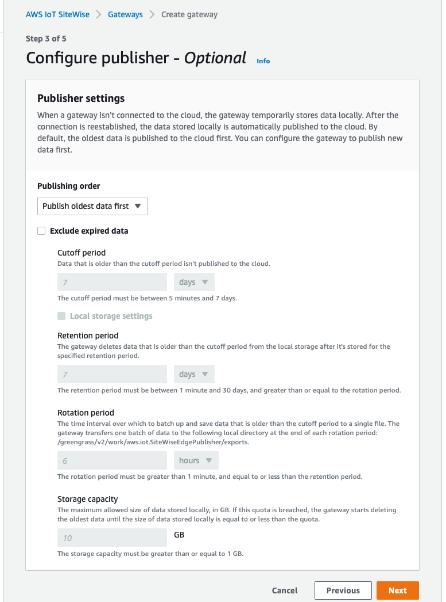


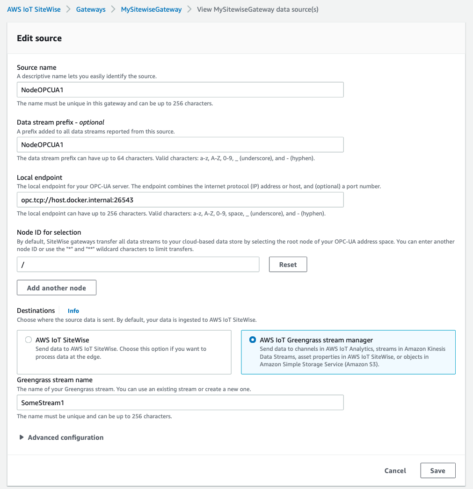


##### 2.3.2 - Check Opcua messages on StreamManager

Log files for Greengrass and SiteWise components are stored in the directory `/greengrass/v2/logs`

You can check the opcua messages arriving in the StreamManager component at greengrass/v2/work/aws.greengrass.StreamManager/SiteWise_StreamManager1/, like:

```bash
$ tail -f  greengrass/v2/work/aws.greengrass.StreamManager/SomeStream1/0000000000000000000.log
```

A screenshot of the output looks like:

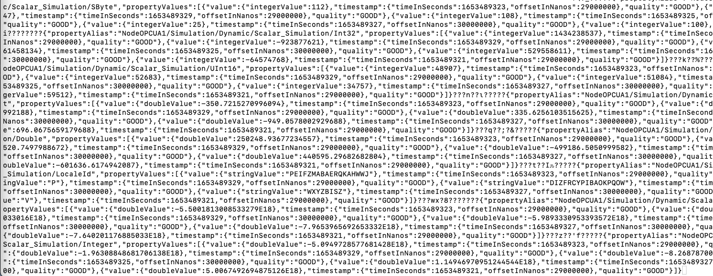


Some other important log files are:

- **greengrass.log**: Logs for AWS IoT Greengrass
- **aws.iot.SiteWiseEdgeCollectorOpcua.log**: Logs for the SiteWise component which collects data from OPC-UA servers
- **aws.iot.SiteWiseEdgeProcessor.log**: Logs for the SiteWise data processing pack. This logs contains mainly information about downloading and spinning up container.
- **aws.iot.SiteWiseEdgePublisher.log**: Logs for the SiteWise component that sends data to the SiteWise data store in the Cloud.


#### 2.4 - StreamManager-Kinesis custom component

Component are modular software that you use to deploy on greengrass. In this tutorial we need a custom component, which we call **com.example.StreamManagerKinesis**, where the function is to connect the StreamManager stream with traffic from opcua server to the kinesis data stream (ref. section below for creation of kinesis data stream.

You can follow the [HowTo Create first component](https://catalog.us-east-1.prod.workshops.aws/workshops/5ecc2416-f956-4273-b729-d0d30556013f/en-US/chapter4-createfirstcomp). In summary, for creating a custom component you need the recipe and the artifact.

StreamManagerKinesis receipt:

```yaml
{
   "RecipeFormatVersion": "2020-01-25",
   "ComponentName": "com.example.StreamManagerKinesis",
   "ComponentVersion": "1.0.4",
   "ComponentDescription": "AWS IoT Greengrass component with Kinesis, Stream Manager and OPCUA server",
   "ComponentPublisher": "Amazon",
   "ComponentConfiguration": {
      "DefaultConfiguration": {
         "Message": "world"
      }
   },
   "Manifests": [
      {
         "Platform": {
            "os": "linux"
         },
         "Lifecycle": {
            "Run": "python3 -u {artifacts:path}/stream_manager_kinesis.py '{configuration:/Message}'\n"
         },
         "Artifacts": [
            {
               "URI": "s3://YOURBUCKET/greengrass/artifacts/com.example.StreamManagerKinesis/1.0.4/stream_manager_kinesis.py"
            }
         ]
      }
   ]
}
```


See the StreamManagerKinesis artifact code snapshot below (ref. [stream_manager_kinesis.py](https://github.com/marcelcastrobr/opcua_greengrass_kinesis/blob/main/greengrass_components/artifacts/com.example.StreamManagerKinesis/1.0.4/stream_manager_kinesis.py)). The example below create a greengrass StreamManager stream called "SomeStream1".It will then start writing data into that stream and StreamManager will automatically export the written data to a Kinesis Data Stream called "Foo1".

```python
import asyncio
import logging
import random
import time
import sys
import datetime

from stream_manager import (
    ExportDefinition,
    KinesisConfig,
    MessageStreamDefinition,
    ReadMessagesOptions,
    ResourceNotFoundException,
    StrategyOnFull,
    StreamManagerClient,
)
def main(logger):
    try:
        stream_name = "SomeStream1"
        kinesis_stream_name = "Foo1"

        # Create a client for the StreamManager
        client = StreamManagerClient()

        message = f"StreamManagerKinesis: able to instantiate client!"
        logger.info(message)

        # Try deleting the stream (if it exists) so that we have a fresh start
        try:
            client.delete_message_stream(stream_name=stream_name)
        except ResourceNotFoundException:
            pass
        except Exception as e:
            logger.error(f"General exception error while trying to execute delete_message_stream: {e}")
            pass

        exports = ExportDefinition(
            kinesis=[
                KinesisConfig(
                    identifier="KinesisExport" + stream_name, 
                    kinesis_stream_name=kinesis_stream_name,
                    batch_size =2
                    )]
        )
        try:
            logger.info("Creating stream: " + stream_name)
            client.create_message_stream(
                MessageStreamDefinition(
                    name=stream_name, 
                    strategy_on_full=StrategyOnFull.OverwriteOldestData, 
                    export_definition=exports
                )
            )
            logger.info("Stream created: " + stream_name)
        except StreamManagerException as e:
            logger.error(f"Error creating message stream: {e}")
            pass
        except Exception as e:
            logger.error(f"General exception error: {e}")
            pass


    except asyncio.TimeoutError:
        logger.exception("Timed out while executing")
    except Exception:
        logger.exception("Exception while running")
    finally:
        # Always close the client to avoid resource leaks
        if client:
            client.close()


logging.basicConfig(level=logging.INFO)
main(logger=logging.getLogger())
```


#### 2.5 - Kinesis Data Stream


#### 2.6 - Kinesis Firehose and S3 storage 

Reason: data retention compliance and database recovery.

#### 2.7 - Kinesis-timescaleDB lambda function


##### 2.7.1 Lambda function

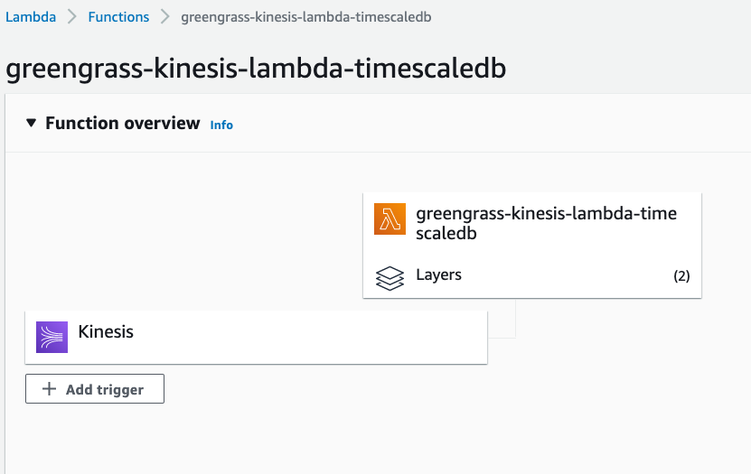


Below you see the code snip from the Kinesis-timescaleDB lambda function defined in greengrass-kinesis-lambda-timescaledb.py. This function has the task to get the data from the kinesis data stream defined before and insert it into the timescaleDB database located in an EC2 instance.

```python
...
def lambda_handler(event, context):
    #print("Received event: " + json.dumps(event, indent=2))
    
    # Getting database credentials from secret manager
    secret_string = get_secret()
    
    # Connecting to the database
    conn = connect_database(json.loads(secret_string))

    for record in event['Records']:
        try:
            # Kinesis data is base64 encoded so decode here
            payload = base64.b64decode(
                record['kinesis']['data']).decode('utf-8')
            
            #For test purpose
            #payload = datavalue
            #print(f"Decoded payload type {type(payload)}: {payload}")
    
            # Sending data to timescaledb
            payload, payload_type = get_payload(payload)
            print(payload)

            # Use INSERT command for simplicity
            #insert_data(conn, payload)

            # Use COPY command to improve time and memory usage
            # Ref.https://hakibenita.com/fast-load-data-python-postgresql
            copy_string_iterator(conn, payload_type, payload)
            print(f"Able to write payload to database!!!!")

        except ValueError:
            print(f"Not able to decode {record['kinesis']['data']}")
        except:
            print("Unexpected error")
    return 'Successfully processed {} records.'.format(len(event['Records']))
...
```


##### 2.7.2 - The kinesis trigger

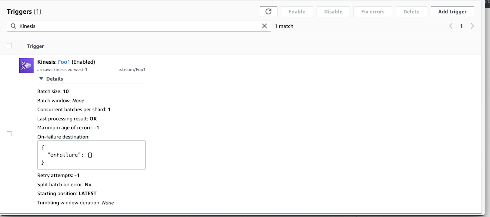


#### 2.8 - TimescaleDB


##### 2.8.1 - Installation


##### 2.8.2 - Configuration

/etc/postgresql/12/main/postgresql.conf

/etc/postgresql/12/main/pg_hba.conf

```bash
# Database administrative login by Unix domain socket
local   all             postgres                                peer

# TYPE  DATABASE        USER            ADDRESS                 METHOD

# "local" is for Unix domain socket connections only
local   all             all                                     peer
# IPv4 local connections:
host    all             all             127.0.0.1/32            md5
# IPv6 local connections:
host    all             all             ::1/128                 md5
# IPv4 connection from company network
#host    all             all             10.0.0.0/8                 scram-sha-256
#host    all             all             10.0.0.0/8                 scram-sha-256
host    all             all             10.0.0.0/8                 trust
host    all             dbadmin             all                 trust
# Allow replication connections from localhost, by a user with the
# replication privilege.
local   replication     all                                     peer
host    replication     all             127.0.0.1/32            md5
host    replication     all             ::1/128                 md5
```


Accessing database from within EC2.

```bash
$ psql --host=localhost --dbname=YOUR-DATABASE --username=YOUR-USERNAME
```


#### 2.9 - Grafana

​	

#### 3 -  Monitoring and Debugging


##### 3.1 - Logs insigth:

```sql
# Amount of message generated per opcua topic.
fields number_of_message, @message
| stats count(*) as number_of_message by bin (5m), @message
| filter  @message like 'opcuapath'
```


##### 3.2 - CloudFormation template to monitor greengrass logs

```yaml
---
AWSTemplateFormatVersion: "2010-09-09"

Parameters:
  DashboardName:
    Description: "Dashboard Name"
    Type: String
    AllowedPattern: ^[0-9a-zA-Z-_]{1,255}$
    ConstraintDescription: "The maximum length is 255, and valid characters are A-Z, a-z, 0-9, '-', and '_'"
  GatewayId:
    Description: "SiteWise Edge Gateway Id"
    Type: String
    AllowedPattern: ^[0-9a-f]{8}-[0-9a-f]{4}-[0-9a-f]{4}-[0-9a-f]{4}-[0-9a-f]{12}$
    ConstraintDescription: "Fixed length of 36 SiteWise Gateway Id"

Resources:
  SiteWiseEdgeDemoDashboard:
    Type: AWS::CloudWatch::Dashboard
    Properties:
      DashboardName: !Ref DashboardName
      DashboardBody: !Sub |
        {
            "widgets": [
                {
                    "height": 6,
                    "width": 12,
                    "y": 0,
                    "x": 0,
                    "type": "metric",
                    "properties": {
                        "view": "timeSeries",
                        "stacked": false,
                        "metrics": [
                            [ "AWS/IoTSiteWise", "IoTSiteWisePublisher.PublisherMessagesRemaining", "GatewayId", "${GatewayId}" ]
                        ],
                        "region": "us-west-2"
                    }
                },
                {
                    "type": "metric",
                    "x": 12,
                    "y": 0,
                    "width": 12,
                    "height": 6,
                    "properties": {
                        "view": "timeSeries",
                        "stacked": false,
                        "metrics": [
                            [ "AWS/IoTSiteWise", "OpcUaCollector.IncomingValuesCount", "GatewayId", "${GatewayId}" ],
                            [ ".", "IoTSiteWisePublisher.PublishSuccessCount", ".", "." ]
                        ],
                        "region": "us-west-2"
                    }
                },
                {
                    "type": "metric",
                    "x": 0,
                    "y": 6,
                    "width": 24,
                    "height": 6,
                    "properties": {
                        "view": "timeSeries",
                        "stacked": false,
                        "metrics": [
                            [ "AWS/IoTSiteWise", "Gateway.DataProcessor.IngestionThrottled", "GatewayId", "${GatewayId}", "ThrottledAt", "SiteWiseEdgeStream" ]
                        ],
                        "region": "us-west-2"
                    }
                },
                {
                    "type": "metric",
                    "x": 0,
                    "y": 24,
                    "width": 24,
                    "height": 6,
                    "properties": {
                        "view": "timeSeries",
                        "stacked": false,
                        "metrics": [
                            [ "AWS/IoTSiteWise", "Gateway.DataProcessor.MeasurementRejected", "GatewayId", "${GatewayId}", "Reason", "TimeStampOutOfRange" ],
                            [ ".", "Gateway.DataProcessor.ProcessingError", ".", ".", ".", "InternalError" ],
                            [ ".", "Gateway.DataProcessor.MeasurementRejected", ".", ".", ".", "InvalidRequest" ],
                            [ "...", "ResourceNotFound" ]
                        ],
                        "region": "us-west-2",
                        "title": "Data Processor Meassurement Errors",
                        "period": 300
                    }
                },
                {
                    "type": "metric",
                    "x": 0,
                    "y": 18,
                    "width": 12,
                    "height": 6,
                    "properties": {
                        "view": "timeSeries",
                        "stacked": false,
                        "metrics": [
                            [ "AWS/IoTSiteWise", "IoTSiteWisePublisher.PublishRejectedCount", "GatewayId", "${GatewayId}" ]
                        ],
                        "region": "us-west-2"
                    }
                },
                {
                    "type": "metric",
                    "x": 12,
                    "y": 18,
                    "width": 12,
                    "height": 6,
                    "properties": {
                        "view": "timeSeries",
                        "stacked": false,
                        "metrics": [
                            [ "AWS/IoTSiteWise", "IoTSiteWisePublisher.PublishFailureCount", "GatewayId", "${GatewayId}" ]
                        ],
                        "region": "us-west-2"
                    }
                },
                {
                    "type": "metric",
                    "x": 0,
                    "y": 12,
                    "width": 24,
                    "height": 6,
                    "properties": {
                        "view": "timeSeries",
                        "stacked": false,
                        "metrics": [
                            [ "AWS/IoTSiteWise", "OpcUaCollector.ConversionErrors", "GatewayId", "${GatewayId}" ]
                        ],
                        "region": "us-west-2"
                    }
                }
            ]
        }
```


## Docker Extras for Amazon linux image:

```bash
# For ifconfig
$ yum install net-tools

# For ping
$ yum install iputils 

# To ping the host
$ ping host.docker.internal 
```

